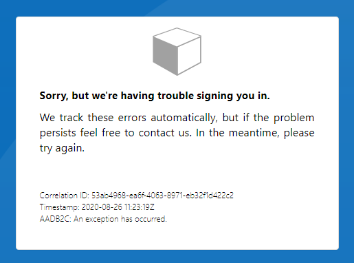

# azure-ad-b2c-ief-datatype-error-reproduce

When an error occurs in Azure AD B2C Costom Policy, cause of the error can not possible to trace the cause from the error message displayed.

This repo is for reproducing it.

## Error message

When run the custom policy in this repository, The following message is displayed

We don't know what happened from this error message.

## Cause of the error

Cause of the error is following:

- In Base, DataType of "timestamp" is `string` (Base - line 19)
- When execute UserJourney, REST API response is set to "timestamp" (Base - line:429), but, REST API response DataType of "timestamp" is `dataType`

To fix the error set the DataType of "timestamp" to `dateTime`.

We would like to show a detailed error to increase the productivity of Custom Policy development.
